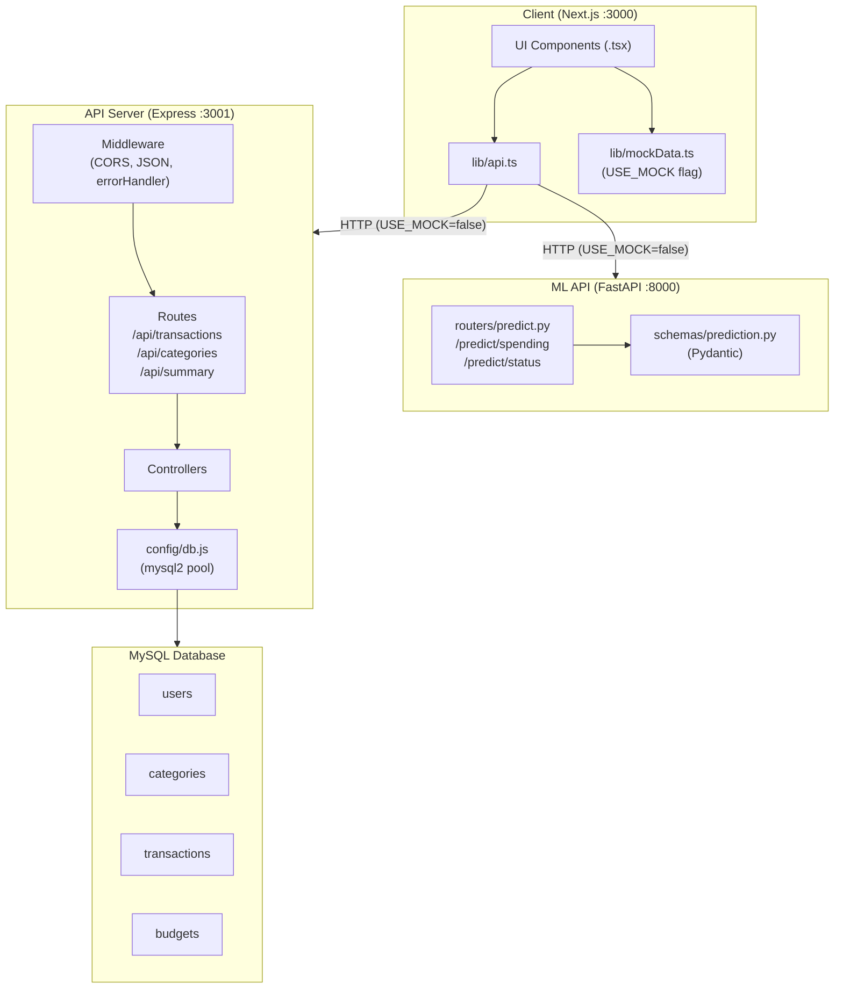

# Design Document: Spendly Backend Integration

## Overview

This document describes the technical design for wiring the existing Spendly Next.js frontend to a real backend. The integration introduces three new layers without touching any existing UI code:

1. **Express REST API** (`server/`) — Node.js + Express + MySQL2, port 3001
2. **FastAPI ML Stub** (`ml-api/`) — Python + FastAPI + Pydantic + Uvicorn, port 8000
3. **Frontend API Service** (`lib/api.ts`) — centralised HTTP client for the Next.js app

The frontend already works with mock data in `lib/mockData.ts`. A single `USE_MOCK` boolean flag controls whether the app uses mock data or live API calls. No `.tsx`, `.css`, or asset files are modified.

---

## Architecture

### High-Level System Diagram



### Request Flow

**Transaction fetch:**
```
Client → GET /api/transactions?month=2025-07
       → Express router → transactionController.getAll()
       → mysql2 pool query (SELECT … WHERE YEAR(date)=2025 AND MONTH(date)=7)
       → JSON response { success: true, data: [...] }
```

**ML prediction:**
```
Client → POST /predict/status  (body: { user_id, current_spending })
       → FastAPI router → predict_status()
       → Pydantic validation → stub logic
       → JSON response { status: "AMAN", confidence: 0.87, reason: "..." }
```

---

## Components and Interfaces

### Express Server Structure

```
server/
├── app.js              # Express app factory (middleware + routes)
├── server.js           # Entry point — binds to PORT
├── .env.example        # Required env var template
├── package.json
├── config/
│   └── db.js           # mysql2 createPool(), exports pool
├── routes/
│   ├── transactions.js # Router for /api/transactions
│   ├── categories.js   # Router for /api/categories
│   └── summary.js      # Router for /api/summary
├── controllers/
│   ├── transactionController.js
│   ├── categoryController.js
│   └── summaryController.js
├── middleware/
│   └── errorHandler.js # Centralised error → { success: false, error }
└── db/
    ├── schema.sql       # CREATE TABLE IF NOT EXISTS …
    └── seed.sql         # Demo user, 8 categories, 25+ transactions, budgets
```

**`app.js` responsibilities:**
- `cors({ origin: 'http://localhost:5173' })`
- `express.json()`
- Mount routers at `/api/transactions`, `/api/categories`, `/api/summary`
- Mount `errorHandler` as the last middleware

**`config/db.js`** exports a `mysql2/promise` connection pool reading from `process.env`:
```js
const pool = mysql.createPool({
  host:     process.env.DB_HOST,
  port:     process.env.DB_PORT,
  user:     process.env.DB_USER,
  password: process.env.DB_PASSWORD,
  database: process.env.DB_NAME,
  waitForConnections: true,
  connectionLimit: 10,
})
module.exports = pool
```

**`middleware/errorHandler.js`** — catches errors thrown by controllers and formats them:
```js
module.exports = (err, req, res, next) => {
  const status = err.status || 500
  res.status(status).json({ success: false, error: err.message || 'Internal server error' })
}
```

Controllers use a `next(err)` pattern; they never call `res.json` directly on errors.

---

### FastAPI ML Stub Structure

```
ml-api/
├── main.py             # FastAPI app factory, mounts routers, /health
├── requirements.txt    # fastapi, uvicorn, pydantic
├── routers/
│   └── predict.py      # POST /predict/spending, POST /predict/status
└── schemas/
    └── prediction.py   # Pydantic request/response models
```

**`main.py`:**
```python
from fastapi import FastAPI
from routers import predict

app = FastAPI(title="Spendly ML API")

@app.get("/health")
def health():
    return {"status": "ok"}

app.include_router(predict.router, prefix="/predict")
```

**`schemas/prediction.py`** defines four Pydantic models:
- `SpendingRequest` — `user_id: str`, `current_spending: int`
- `SpendingResponse` — `predicted_amount: int`, `currency: str`, `month: str`
- `StatusRequest` — `user_id: str`, `current_spending: int`, `monthly_income: int`
- `StatusResponse` — `status: Literal["AMAN","HATI-HATI","BOROS"]`, `confidence: float`, `reason: str`

**`routers/predict.py`** stub logic:
```python
@router.post("/spending", response_model=SpendingResponse)
def predict_spending(req: SpendingRequest):
    # TODO: replace with model.predict(input_features)
    next_month = (date.today().replace(day=1) + timedelta(days=32)).strftime("%Y-%m")
    return SpendingResponse(
        predicted_amount=int(req.current_spending * 1.05),
        currency="IDR",
        month=next_month,
    )

@router.post("/status", response_model=StatusResponse)
def predict_status(req: StatusRequest):
    # TODO: replace with model.predict(input_features)
    ratio = req.current_spending / req.monthly_income if req.monthly_income else 0
    if ratio <= 0.7:
        status, confidence, reason = "AMAN", 0.90, "Pengeluaran masih dalam batas aman."
    elif ratio <= 0.9:
        status, confidence, reason = "HATI-HATI", 0.75, "Pengeluaran mendekati batas bulanan."
    else:
        status, confidence, reason = "BOROS", 0.85, "Pengeluaran melebihi 90% pendapatan."
    return StatusResponse(status=status, confidence=confidence, reason=reason)
```

---

### Frontend API Service Layer

**`lib/api.ts`** — the only new frontend file:

```typescript
const API_BASE = 'http://localhost:3001/api'
const ML_BASE  = 'http://localhost:8000'

export async function getTransactions(month?: string): Promise<Transaction[]> {
  const url = month
    ? `${API_BASE}/transactions?month=${month}`
    : `${API_BASE}/transactions`
  const res = await fetch(url)
  const json = await res.json()
  if (!json.success) throw new Error(json.error)
  return json.data
}

export async function addTransaction(payload: Omit<Transaction, 'id' | 'created_at'>): Promise<Transaction> {
  const res = await fetch(`${API_BASE}/transactions`, {
    method: 'POST',
    headers: { 'Content-Type': 'application/json' },
    body: JSON.stringify(payload),
  })
  const json = await res.json()
  if (!json.success) throw new Error(json.error)
  return json.data
}

export async function getCategories(): Promise<Category[]> {
  const res = await fetch(`${API_BASE}/categories`)
  const json = await res.json()
  if (!json.success) throw new Error(json.error)
  return json.data
}

export async function getMonthlySummary(userId: string): Promise<MonthlySummary> {
  const res = await fetch(`${API_BASE}/summary/${userId}`)
  const json = await res.json()
  if (!json.success) throw new Error(json.error)
  return json.data
}

export async function getPrediction(userId: string, currentSpending: number, monthlyIncome: number): Promise<PredictionStatus> {
  const res = await fetch(`${ML_BASE}/predict/status`, {
    method: 'POST',
    headers: { 'Content-Type': 'application/json' },
    body: JSON.stringify({ user_id: userId, current_spending: currentSpending, monthly_income: monthlyIncome }),
  })
  const json = await res.json()
  return json
}
```

**`lib/mockData.ts` change** — prepend one line only:
```typescript
export const USE_MOCK = true  // set to false to use live API
```
All existing exports remain untouched.

---

## Data Models

### MySQL Schema

```sql
-- schema.sql

CREATE TABLE IF NOT EXISTS users (
  id             VARCHAR(36)  NOT NULL PRIMARY KEY,
  name           VARCHAR(100) NOT NULL,
  email          VARCHAR(150) NOT NULL UNIQUE,
  monthly_income INT          NOT NULL DEFAULT 0,
  created_at     TIMESTAMP    NOT NULL DEFAULT CURRENT_TIMESTAMP
);

CREATE TABLE IF NOT EXISTS categories (
  id    VARCHAR(36)              NOT NULL PRIMARY KEY,
  name  VARCHAR(50)              NOT NULL UNIQUE,
  icon  VARCHAR(10)              NOT NULL,
  type  ENUM('expense','income') NOT NULL,
  color VARCHAR(7)               NOT NULL  -- hex, e.g. #FF6B6B
);

CREATE TABLE IF NOT EXISTS transactions (
  id             VARCHAR(36)                                    NOT NULL PRIMARY KEY,
  user_id        VARCHAR(36)                                    NOT NULL,
  category_id    VARCHAR(36)                                    NOT NULL,
  type           ENUM('expense','income','transfer')            NOT NULL,
  amount         INT                                            NOT NULL,
  account        VARCHAR(100)                                   NOT NULL,
  payment_method ENUM('cash','transfer','e-wallet','credit')    NOT NULL,
  note           TEXT,
  date           DATE                                           NOT NULL,
  created_at     TIMESTAMP                                      NOT NULL DEFAULT CURRENT_TIMESTAMP,
  FOREIGN KEY (user_id)     REFERENCES users(id)      ON DELETE CASCADE,
  FOREIGN KEY (category_id) REFERENCES categories(id) ON DELETE RESTRICT
);

CREATE TABLE IF NOT EXISTS budgets (
  id            INT         NOT NULL AUTO_INCREMENT PRIMARY KEY,
  user_id       VARCHAR(36) NOT NULL,
  category_id   VARCHAR(36) NOT NULL,
  monthly_limit INT         NOT NULL,
  month         VARCHAR(7)  NOT NULL,  -- YYYY-MM
  UNIQUE KEY uq_budget (user_id, category_id, month),
  FOREIGN KEY (user_id)     REFERENCES users(id)      ON DELETE CASCADE,
  FOREIGN KEY (category_id) REFERENCES categories(id) ON DELETE RESTRICT
);
```

### Seed Data Overview

`seed.sql` inserts:
- **1 demo user** — `id: 'user-demo-001'`, name: `Raihanah`, monthly_income: `5000000`
- **8 categories** — 6 expense + 2 income (see table below)
- **25+ transactions** — dated July 2025, mix of expense/income, amounts Rp 5,000–3,500,000
- **8 budget rows** — one per category for `2025-07`

| Name        | Icon | Type    | Color   |
|-------------|------|---------|---------|
| Makan       | 🍽️  | expense | #FF6B6B |
| Transport   | 🚗   | expense | #4ECDC4 |
| Belanja     | 🛍️  | expense | #95E1D3 |
| Pendidikan  | 📚   | expense | #FFB3BA |
| Hiburan     | 🎮   | expense | #A0E7E5 |
| Lain-lain   | 📦   | expense | #7FD8BE |
| Gaji        | 💼   | income  | #6BCB77 |
| Freelance   | 💻   | income  | #4D96FF |

### API Response Shapes

**Transaction object** (as returned by the API):
```typescript
{
  id:             string        // UUID
  user_id:        string
  type:           'expense' | 'income' | 'transfer'
  amount:         number        // integer IDR
  category:       string        // category name
  category_icon:  string        // emoji
  account:        string
  payment_method: 'cash' | 'transfer' | 'e-wallet' | 'credit'
  note?:          string
  date:           string        // YYYY-MM-DD
  created_at:     string        // ISO timestamp
}
```

**Category object:**
```typescript
{ id: string; name: string; icon: string; type: 'expense' | 'income'; color: string }
```

**Monthly summary object:**
```typescript
{ total_income: number; total_expenses: number; balance: number }
```

The controller joins `transactions` with `categories` to populate `category` and `category_icon` in a single query, avoiding N+1 fetches.

---

## Correctness Properties

*A property is a characteristic or behavior that should hold true across all valid executions of a system — essentially, a formal statement about what the system should do. Properties serve as the bridge between human-readable specifications and machine-verifiable correctness guarantees.*

### Property 1: Successful response envelope shape

*For any* valid HTTP request to any Express API endpoint, the response body SHALL contain `success: true` and a `data` field (which may be an array, object, or null).

**Validates: Requirements 1.3**

---

### Property 2: Error response envelope shape

*For any* HTTP request that triggers an error (invalid id, missing fields, server fault), the response body SHALL contain `success: false` and an `error` string, with an HTTP status code ≥ 400.

**Validates: Requirements 1.4**

---

### Property 3: Transactions are ordered by date descending

*For any* set of transactions stored in the database, a `GET /api/transactions` response SHALL return them such that for every adjacent pair `(t[i], t[i+1])`, `t[i].date >= t[i+1].date`.

**Validates: Requirements 2.1**

---

### Property 4: Month filter returns only in-month transactions

*For any* `?month=YYYY-MM` query parameter and any set of transactions in the database, every transaction in the response SHALL have a `date` whose year and month match the requested `YYYY-MM`, and no transaction outside that month SHALL appear.

**Validates: Requirements 2.2**

---

### Property 5: Transaction create-then-fetch round trip

*For any* valid transaction payload, after a successful `POST /api/transactions`, a subsequent `GET /api/transactions/:id` using the returned `id` SHALL return a transaction whose fields match the original payload, and the returned `id` SHALL be a valid UUID (RFC 4122 format).

**Validates: Requirements 2.3, 2.5**

---

### Property 6: Transaction delete removes it from the store

*For any* existing transaction, after a successful `DELETE /api/transactions/:id` (HTTP 200, `{ success: true, data: null }`), a subsequent `GET /api/transactions/:id` SHALL return HTTP 404.

**Validates: Requirements 2.7**

---

### Property 7: Missing required fields returns HTTP 400

*For any* `POST /api/transactions` or `PUT /api/transactions/:id` request body that omits one or more of the required fields (`user_id`, `type`, `amount`, `category`, `account`, `payment_method`, `date`), the API SHALL return HTTP 400 with `{ success: false, error: <non-empty string> }`.

**Validates: Requirements 2.8, 2.9**

---

### Property 8: Transaction response shape contains all required fields

*For any* transaction returned from any endpoint (`GET /api/transactions`, `GET /api/transactions/:id`, `POST`, `PUT`), the object SHALL contain all of: `id`, `user_id`, `type`, `amount`, `category`, `category_icon`, `account`, `payment_method`, `date`, and `created_at`.

**Validates: Requirements 2.10**

---

### Property 9: Category response shape contains all required fields

*For any* category returned from `GET /api/categories`, the object SHALL contain all of: `id`, `name`, `icon`, `type`, and `color`.

**Validates: Requirements 3.2**

---

### Property 10: Monthly summary correctly aggregates income and expenses

*For any* set of `expense` and `income` transactions inserted for a given `user_id` in the current calendar month, `GET /api/summary/:user_id` SHALL return `total_income` equal to the sum of all income amounts, `total_expenses` equal to the sum of all expense amounts, and `balance` equal to `total_income - total_expenses`.

**Validates: Requirements 4.1, 4.2**

---

### Property 11: Spending prediction response shape and value constraints

*For any* valid `POST /predict/spending` request, the response SHALL contain `predicted_amount` (a positive integer), `currency` equal to `"IDR"`, and `month` matching the regex `^\d{4}-\d{2}$` representing the next calendar month relative to the request time.

**Validates: Requirements 7.2**

---

### Property 12: Status prediction response shape and value constraints

*For any* valid `POST /predict/status` request, the response SHALL contain `status` ∈ `{"AMAN", "HATI-HATI", "BOROS"}`, `confidence` ∈ `[0.0, 1.0]`, and `reason` as a non-empty string.

**Validates: Requirements 7.3**

---

### Property 13: Invalid ML API request returns HTTP 422

*For any* `POST /predict/spending` or `POST /predict/status` request body that omits a required field or provides a value of the wrong type, the ML API SHALL return HTTP 422 (Unprocessable Entity) with a Pydantic validation error body.

**Validates: Requirements 7.6**

---

### Property 14: `addTransaction` sends the correct payload

*For any* valid transaction payload object, calling `addTransaction(payload)` SHALL issue exactly one `POST` request to `http://localhost:3001/api/transactions` with `Content-Type: application/json` and a body that is the JSON serialisation of `payload`.

**Validates: Requirements 8.3**

---

### Property 15: `getMonthlySummary` constructs the correct URL for any userId

*For any* non-empty `userId` string, calling `getMonthlySummary(userId)` SHALL issue a `GET` request to `http://localhost:3001/api/summary/${userId}` with no additional path segments or query parameters.

**Validates: Requirements 8.5**

---

## Error Handling

### Express Error Strategy

All controller functions are wrapped in `try/catch`. Errors are forwarded to the centralised `errorHandler` middleware via `next(err)`. Controllers never write error responses directly.

```
Controller throws / calls next(err)
  → errorHandler middleware
  → res.status(err.status || 500).json({ success: false, error: err.message })
```

**HTTP status mapping:**

| Condition                        | Status |
|----------------------------------|--------|
| Resource not found               | 404    |
| Missing / invalid request fields | 400    |
| Database constraint violation    | 409    |
| Unhandled server error           | 500    |

**Database errors** — mysql2 errors are caught and re-thrown with a sanitised message (never exposing raw SQL or credentials to the client).

### FastAPI Error Strategy

FastAPI + Pydantic handles request validation automatically, returning HTTP 422 with a structured error body for any schema violation. Application-level errors (e.g., unexpected computation failures) are caught and returned as HTTP 500 with a JSON body.

### Frontend Error Strategy

Each function in `lib/api.ts` checks `json.success`. If `false`, it throws a `new Error(json.error)`. Callers (UI components) are responsible for catching and displaying errors — this keeps the API service layer thin and testable.

---

## Testing Strategy

### Dual Testing Approach

Both unit/example tests and property-based tests are used. Unit tests cover specific examples, integration points, and edge cases. Property tests verify universal invariants across many generated inputs.

### Property-Based Testing

The feature involves pure data transformation logic (filtering, aggregation, validation, URL construction) that is well-suited to property-based testing.

**Library choices:**
- **Express API**: [fast-check](https://github.com/dubzzz/fast-check) (TypeScript/JavaScript)
- **FastAPI ML stub**: [Hypothesis](https://hypothesis.readthedocs.io/) (Python)

Each property test runs a **minimum of 100 iterations**.

Each test is tagged with a comment referencing the design property:
```
// Feature: spendly-backend-integration, Property 3: Transactions are ordered by date descending
```

**Properties to implement as property-based tests:**

| Property | Test file | Library |
|----------|-----------|---------|
| P1 — Success envelope shape | `server/tests/envelope.property.test.js` | fast-check |
| P2 — Error envelope shape | `server/tests/envelope.property.test.js` | fast-check |
| P3 — Date ordering | `server/tests/transactions.property.test.js` | fast-check |
| P4 — Month filter | `server/tests/transactions.property.test.js` | fast-check |
| P5 — Create-fetch round trip | `server/tests/transactions.property.test.js` | fast-check |
| P6 — Delete removes from store | `server/tests/transactions.property.test.js` | fast-check |
| P7 — Missing fields → 400 | `server/tests/validation.property.test.js` | fast-check |
| P8 — Transaction response shape | `server/tests/transactions.property.test.js` | fast-check |
| P9 — Category response shape | `server/tests/categories.property.test.js` | fast-check |
| P10 — Summary aggregation | `server/tests/summary.property.test.js` | fast-check |
| P11 — Spending prediction shape | `ml-api/tests/test_predict.py` | Hypothesis |
| P12 — Status prediction shape | `ml-api/tests/test_predict.py` | Hypothesis |
| P13 — Invalid ML request → 422 | `ml-api/tests/test_predict.py` | Hypothesis |
| P14 — addTransaction payload | `lib/__tests__/api.property.test.ts` | fast-check |
| P15 — getMonthlySummary URL | `lib/__tests__/api.property.test.ts` | fast-check |

### Unit / Example Tests

- **Express**: Jest + Supertest for endpoint integration tests (smoke: server starts, CORS headers, 404 for unknown routes, empty-month summary returns zeros)
- **FastAPI**: pytest for health endpoint, known-good request/response examples
- **Frontend**: Jest + `@testing-library/react` for `USE_MOCK` toggle behaviour, `getCategories` and `getPrediction` call verification

### What Is NOT Property-Tested

- Database schema idempotency (smoke test: run `schema.sql` twice, verify no error)
- Seed data counts and ranges (smoke test: query counts after `seed.sql`)
- README content (manual review)
- CORS configuration (smoke test: single preflight request)
- `USE_MOCK` flag existence (smoke test: import check)

### Manual Testing — Postman Collection

A Postman collection file (`spendly.postman_collection.json`) SHALL be generated and placed at the repo root. It covers every endpoint across both services and is importable by any team member with one click.

**Collection structure:**

```
Spendly API
├── Express API (localhost:3001)
│   ├── Transactions
│   │   ├── GET  /api/transactions               — list all
│   │   ├── GET  /api/transactions?month=2025-07 — filtered by month
│   │   ├── GET  /api/transactions/:id           — single transaction
│   │   ├── POST /api/transactions               — create (valid body)
│   │   ├── POST /api/transactions               — create (missing fields → 400)
│   │   ├── PUT  /api/transactions/:id           — update
│   │   └── DELETE /api/transactions/:id         — delete
│   ├── Categories
│   │   └── GET  /api/categories                 — list all
│   └── Summary
│       └── GET  /api/summary/user-demo-001      — monthly totals
└── ML API (localhost:8000)
    ├── GET  /health                             — health check
    ├── POST /predict/spending                   — spending forecast
    ├── POST /predict/status                     — AMAN/HATI-HATI/BOROS
    └── POST /predict/status                     — invalid body → 422
```

**Environment variables** used in the collection:
- `{{base_url}}` → `http://localhost:3001/api`
- `{{ml_url}}` → `http://localhost:8000`
- `{{demo_user_id}}` → `user-demo-001`
- `{{transaction_id}}` → populated automatically by the POST create request via a Postman test script

Each request includes example request bodies and expected response assertions (Postman Tests tab) so the team can run the full collection as a smoke test suite.
